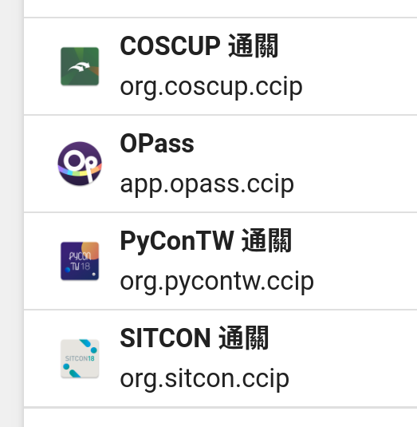
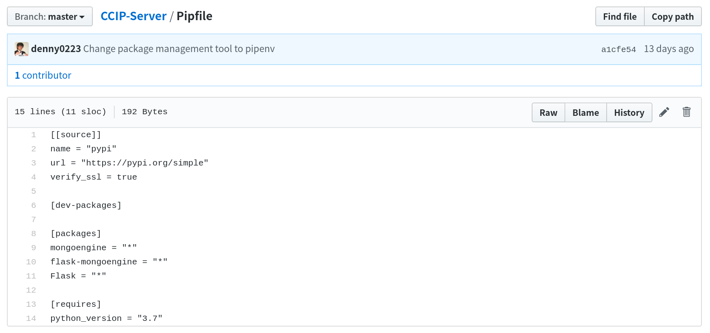
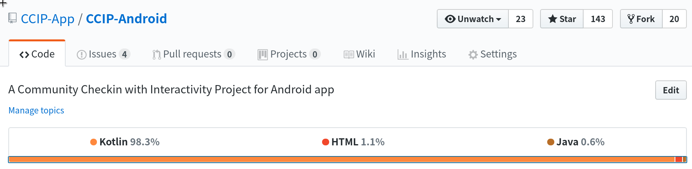
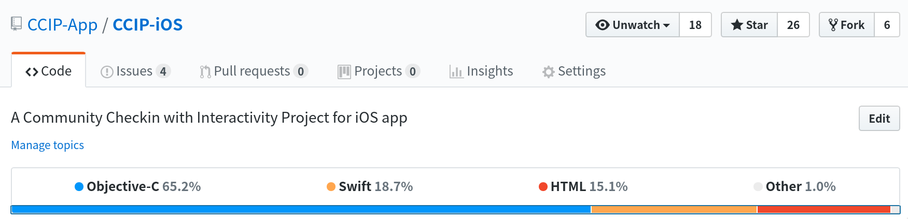
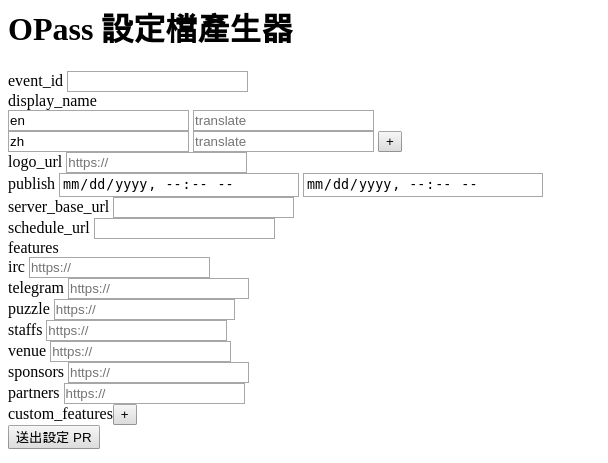
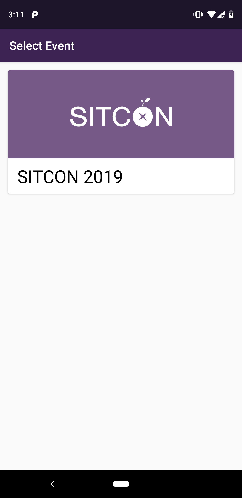
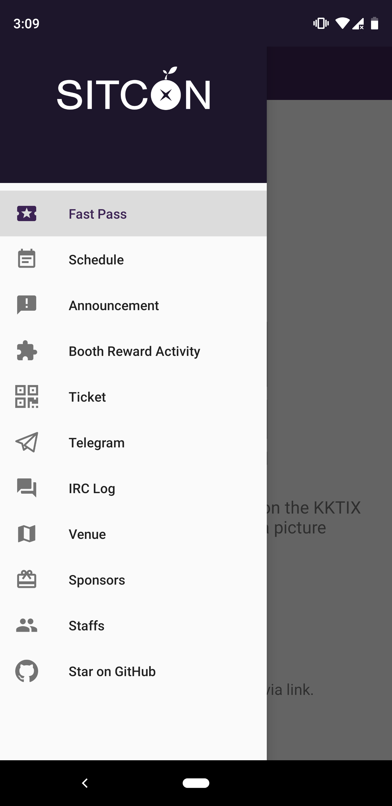
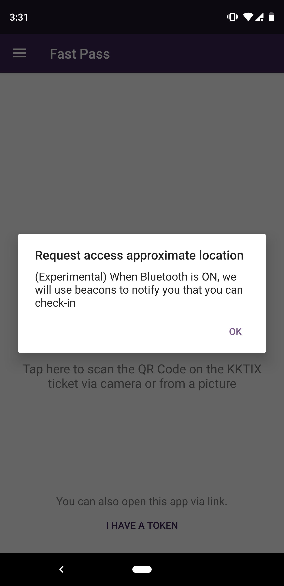
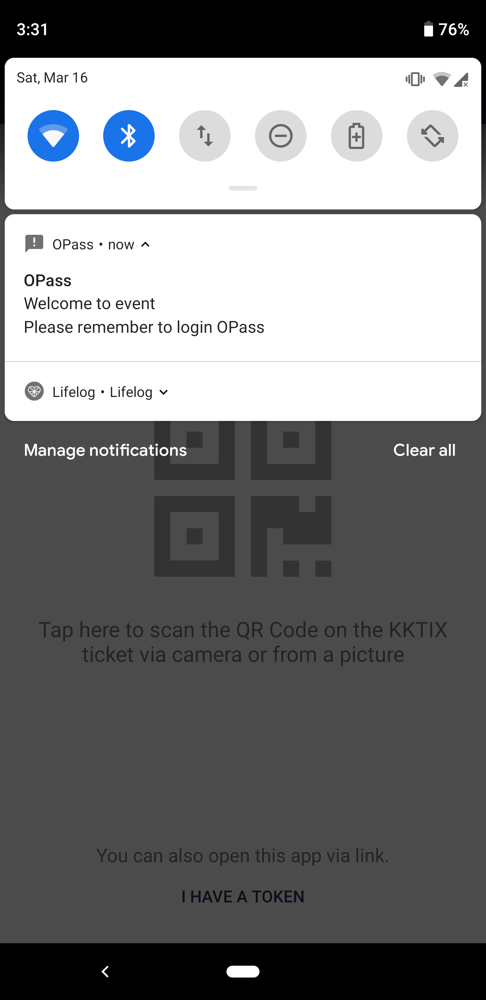

title: 報到 App - OPass 近況更新
output: index.html

--

<h1 style="font-size: 72px">
	報到 App -  
	OPass 近況更新
</h1>
 

## Denny Huang

--

### Who am I ?

 
<h2 style="font-size: 60px">
  <b>Denny Huang</b>
</h2>

* 雷亞遊戲 Rayark Inc.

* SITCON 2013, 2014 總召

* <a href="http://about.me/denny0223" target="_blank">About me</a>

--

   
  

--

### Server

   
  

--

### Android

   
  

--

### iOS

   
  

--

### Portal

   
  

--

   
  

--

   
  

--

# [schedule-json-generator](https://github.com/CCIP-App/schedule-json-generator)

--

   
  

--

   
  

--

<h1 style="font-size: 72px">
  Thanks for listening!
</h1>

   

  

<h2 style="font-size: 18px">
本投影片採用<a href="http://creativecommons.org/licenses/by-sa/3.0/tw/" target="_blank">創用 CC「姓名標示—相同方式分享 3.0 台灣」授權條款</a>
</h2>

